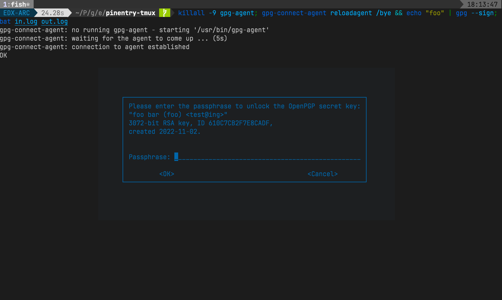

# pinentry-tmux

A alternative pinentry program for GPG that uses a `tmux` popup with the `pinentry-curses` prompt.




## Installation

Installation is an easy three-step process:

**Install the program:**

```bash
git clone https://github.com/eth-p/pinentry-tmux.git
cd pinentry-tmux
sudo cp pinentry-tmux.sh /usr/local/bin/pinentry-tmux
sudo chown root:0 /usr/local/bin/pinentry-tmux
```

**Set up the GNUPG agent:**

Add the following to `~/.gnupg/gpg-agent.conf`.
If the file doesn't exist, create it:

```
pinentry-program /usr/local/bin/pinentry-tmux
```

**Reload the GNUPG agent:**

```bash
gpg-connect-agent reloadagent /bye
```


## How it Works

When called by the GPG agent,  `pinentry-tmux` opens `pinentry-curses` in a tmux popup and forwards the output from the popup back to the GPG agent.

